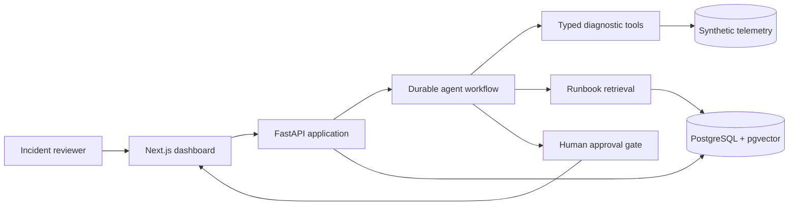

# Architecture

## Goal

SentinelAI demonstrates a production-oriented agent workflow without requiring access to a real production environment. Synthetic incident data makes investigations repeatable, testable, and safe to publish.

## System context



## Repository structure

```text
sentinel-ai/
├── backend/              FastAPI application and Python tests
├── frontend/             Next.js application
├── docs/                 Architecture and engineering decisions
├── .github/workflows/    Continuous integration
└── compose.yaml          Reproducible local environment
```

## Boundaries

- **Web:** presentation and reviewer interactions; it does not contain agent logic.
- **API:** validation, application services, workflow entry points, and persistence boundaries.
- **Workflow:** explicit state transitions, tool selection, checkpointing, and approval pauses.
- **Tools:** narrow, typed access to logs, metrics, deployments, dependencies, and runbooks.
- **Persistence:** incidents, runs, evidence, hypotheses, approvals, audit events, and embeddings.

## Reliability principles

- Conclusions must cite evidence returned by a tool or retrieved source.
- Side-effecting tools require application-enforced approval.
- Tool inputs and outputs are validated with schemas.
- Workflow steps are persisted and safe to retry.
- A run has bounded steps, cost, and execution time.
- Retrieved documents and telemetry are treated as untrusted input.

## Day 1 decisions

1. **Python 3.11 baseline:** matches the available development runtime while retaining modern typing features.
2. **PostgreSQL plus pgvector:** one operational datastore can support relational state and runbook embeddings during the MVP.
3. **No Redis yet:** it is deferred until a concrete queue or caching requirement appears.
4. **Liveness and readiness are separate:** `/health` proves the process is alive; `/ready` checks database connectivity.
5. **Framework isolation:** agent orchestration will live behind application interfaces so business logic is not coupled throughout the API.
6. **Async resources follow the application lifecycle:** FastAPI's lifespan creates one SQLAlchemy `AsyncEngine` for the process, readiness borrows connections from it, and shutdown disposes it. This avoids per-request pool creation and prevents leaked connections during reloads and tests.
7. **Quality gates protect downstream agent work:** linting and type checks catch interface drift before runtime, tests preserve operational contracts, and production builds catch environment-only integration failures before later workflow and tool layers depend on the foundation.
8. **Domain records are immutable contracts:** incident, telemetry, evidence, hypothesis, run, and audit models reject unknown fields and dangling fixture references before persistence is introduced.
9. **Provenance travels with telemetry:** each log, metric, and deployment event carries its source locator and a timezone-aware observation timestamp; evidence cites telemetry IDs rather than copying untraceable values.
10. **Golden data is reproducible:** a local seeded generator, fixed UTC timeline, and content-derived stable IDs produce the checked-in incident JSON without wall-clock or global-random dependencies.
